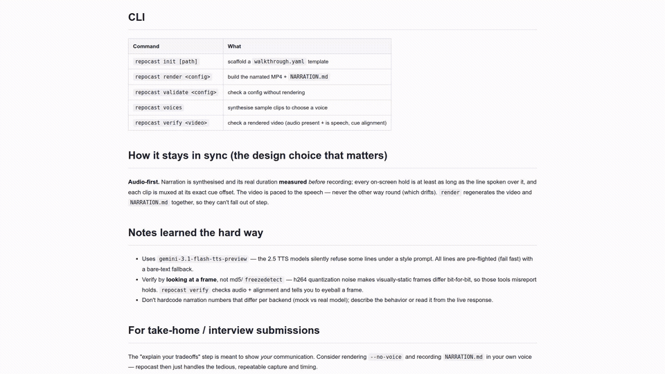

# repocast

**Ask a coding agent to make a technical demo. Repocast compiles its reproducible
instructions into a polished, narrated video.**

Repocast turns a source-controlled `walkthrough.yaml` into an MP4 or GIF. A demo can
combine rendered documentation, real terminal commands, a live browser application,
screenshots, diagrams, and existing video. Narration is paced from measured speech,
with optional captions and a machine-readable verification report.

It is designed for Claude Code, Codex, and other coding agents: the agent understands
the project and writes the story; the CLI executes and records it deterministically.
Project files, browser recordings, and rendered outputs stay local. When Gemini narration
is enabled, Repocast sends only the narration text to Google's Gemini API for speech
synthesis. Use `tts.provider: none` or `--no-voice` to keep the entire workflow offline.

Useful for product demos, code walkthroughs, take-home submissions, bug reproductions,
release notes, onboarding, API demonstrations, benchmarks, and OSS introductions.

## Demo

[](https://github.com/jd316/repocast/releases/download/v0.1.0/repocast-walkthrough.mp4)

[Watch the narrated walkthrough](https://github.com/jd316/repocast/releases/download/v0.1.0/repocast-walkthrough.mp4),
generated by Repocast from [`examples/selfdemo.yaml`](examples/selfdemo.yaml).

## Install

```bash
uv tool install git+https://github.com/jd316/repocast
playwright install chrome
```

Repocast requires Python 3.10+, FFmpeg/FFprobe, and Chrome or Chromium. Gemini narration
requires `GEMINI_API_KEY`; silent and bring-your-own-voice videos do not.

For Claude Code:

```text
/plugin marketplace add jd316/repocast
/plugin install repocast@repocast
```

For Codex or another skill-aware agent, install or copy `skills/repocast/` into that
agent's skills directory. The skill only drives the public CLI, so the same workflow is
portable between agents.

## Quick start

```bash
repocast init walkthrough.yaml
repocast validate walkthrough.yaml
repocast dry-run walkthrough.yaml
export GEMINI_API_KEY=...
repocast render walkthrough.yaml
```

Use `--no-voice` for a silent video and the generated `NARRATION.md`. Use `--json` with
`validate`, `dry-run`, `render`, or `verify` for agent-readable results. Operational logs
go to stderr in JSON mode, leaving one JSON document on stdout.

## Configuration

Run `repocast schema` for the current machine-readable contract. Paths are relative to
the configuration file.

```yaml
output: demo.mp4                 # .mp4 or .gif
size: youtube                    # youtube | landscape | portrait | square | [width, height]
captions: demo.srt               # true, false, .srt, or .vtt
burn_captions: false             # also render captions into the video
watermark: {text: "DEMO · SYNTHETIC DATA", position: top-left, size: 24}

theme:
  background: "#111827"
  padding: 48
  radius: 18
  shadow: true

video:
  crf: 21
  fps: 30
  preset: slow

quality:
  min_duration: 45
  max_duration: 120
  max_silence: 2
  max_black: 0.5
  loudness_target: -16
  loudness_tolerance: 2

tts:
  provider: gemini               # gemini | none
  voice: Charon
  model: gemini-3.1-flash-tts-preview

segments:
  - doc:
      file: DESIGN.md
      steps:
        - {anchor: architecture, say: "The application has three small layers."}

  - terminal:
      cwd: .
      steps:
        - {run: ["pytest", "-q"], say: "The complete test suite passes."}

  - app:
      cwd: .
      start: ["npm", "run", "dev"]
      url: http://127.0.0.1:3000
      ready_path: /
      cursor: {size: 18, color: "#2563eb", smoothing: 0.28, blur: 0}
      actions:
        - {fill: "#email", value: "demo@example.com", focus: true}
        - {click: "#submit", focus: true, effect: ripple, zoom: 1.12}
        - {wait_for: ".dashboard"}
        - annotate: {target: ".total", text: "Calculated in real time"}
        - check: {no_scroll: true, min_font_size: 18,
                  required_text: ["Calculated in real time"], forbidden_text: ["Internal error"]}
        - {say: "The dashboard updates immediately."}

  - media:
      file: architecture.png     # image, animated GIF, or video
      duration: 5                # optional for video
      speed: 1                   # playback speed for video
      volume: 1                  # source-audio volume
      fade: 0.25
      say: "The workflow can include generated diagrams."
```

Every segment supports `trim: [start_seconds, end_seconds]` and `fade: seconds`.
Terminal commands fail the render on a nonzero exit status; use `allow_failure: true`
only when failure is the behavior being demonstrated.

App verbs are `say`, `click`, `fill`, `wait_for`, `press`, `goto`, `eval`, `sleep`,
`annotate`, and `check`. An annotation may contain `text`, `image`, or `shape`, and can
use a target selector or explicit `x`/`y` coordinates. Place `check` actions after key
states to enforce required/prohibited copy, minimum visible font size, and a no-scroll
layout. Uncaught browser JavaScript errors also fail the segment.

Additional audio and a webcam overlay can be composed without an editor:

```yaml
audio:
  - {file: music.wav, at: 0, volume: 0.15}
webcam:
  file: presenter.mp4
  position: bottom-right
  width: 320
  margin: 32
```

## CLI

| Command | Purpose |
|---|---|
| `repocast init [path]` | Write a starter configuration |
| `repocast schema` | Print the configuration contract as JSON |
| `repocast validate <config>` | Validate without executing the demo |
| `repocast dry-run <config>` | Execute commands and browser actions without recording |
| `repocast render <config>` | Build video, narration, captions, and verification report |
| `repocast voices` | Generate local voice samples |
| `repocast verify <video>` | Decode the video and inspect audio and narration alignment |

`verify` treats missing or near-silent audio as a failure. Pass `--allow-silent` for an
intentional silent export.

Successful rendering produces:

- the configured MP4 or GIF;
- `NARRATION.md` with timestamped narration;
- SRT/VTT captions when enabled;
- `<output>.verify.json` unless `--no-verify` is used;
- `<output>.contact-sheet.jpg` for visual review of representative frames;
- a SHA-256 checksum in JSON output and the verification report.

If rendering fails, the scratch directory is preserved for diagnosis. It is removed only
after a successful render.

Synthesized speech is cached under `~/.cache/repocast/tts` so rerenders do not spend time
or API quota regenerating unchanged lines. Set `REPOCAST_CACHE_DIR` to relocate the cache.

## Timing model

Repocast synthesizes narration first and measures every clip. Each scene then remains on
screen long enough for its narration. Video follows speech timing, avoiding cumulative
voice-over drift. `NARRATION.md` and captions are generated from those same cue marks.

The terminal renderer captures stdout and stderr into HTML instead of recording a terminal
emulator. This works on headless servers and Wayland systems while preserving real command
results.

## License

MIT © Joydip Biswas
